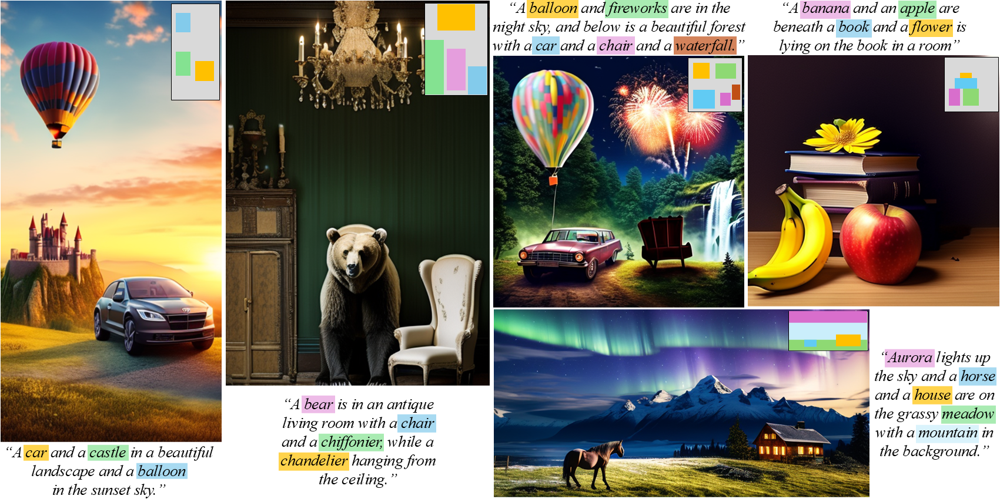

# GrounDiT: Grounding Diffusion Transformers via Noisy Patch Transplantation, NeurIPS 2024


[Phillip Y. Lee](https://phillipinseoul.github.io/)\*, [Taehoon Yoon](https://github.com/taehoon-yoon)\*, [Minhyuk Sung](https://mhsung.github.io/) (* Denotes equal contribution)

| [**Website**](https://groundit-visualai.github.io/) | [**Paper**] | [**arXiv**] |

<br />

## Introduction
This repository contains the official implementation of **GrounDiT: Grounding Diffusion Transformers via Noisy Patch Transplantation**. <br>
More results can be viewed on our [project page](https://groundit-visualai.github.io/).

[//]: # (### Abstract)
> We introduce a novel training-free spatial grounding technique for text-to-image
generation using Diffusion Transformers (DiT). Spatial grounding with bounding
boxes has gained attention for its simplicity and versatility, allowing for enhanced
user control in image generation. However, prior training-free approaches often
rely on updating the noisy image during the reverse diffusion process via backprop-
agation from custom loss functions, which frequently struggle to provide precise
control over individual bounding boxes. In this work, we leverage the flexibility of
the Transformer architecture, demonstrating that DiT can generate noisy patches
corresponding to each bounding box, fully encoding the target object and allowing
for fine-grained control over each region. Our approach builds on an intriguing
property of DiT, which we refer to as semantic sharing. Due to semantic sharing,
when a smaller patch is jointly denoised alongside a generatable-size image, the
two become "semantic clones". Each patch is denoised in its own branch of the gen-
eration process and then transplanted into the corresponding region of the original
noisy image at each timestep, resulting in robust spatial grounding for each bound-
ing box. In our experiments on the HRS and DrawBench benchmarks, we achieve
state-of-the-art performance compared to previous training-free spatial grounding
approaches.

## Code Comming Soon !

## Citation
```
@article{lee2024groundit,
  title = {GrounDiT: Grounding Diffusion Transformers via Noisy Patch Transplantation},
  author = {Lee, Phillip Y. and Yoon, Taehoon and Sung, Minhyuk},
  year = {2024},
  journal = {arXiv:xxxx.xxxxx},
}
```
